<div align="center">

# Vision Tokenization Pipeline

**Scalable GPU tokenization for vision datasets — WebDataset & HuggingFace to Megatron micro-shards**

[](https://www.python.org/downloads/)
[](https://pytorch.org/)
[](https://hydra.cc/)

</div>

---

<table>
<tr>
<td width="50%">

**Input formats**
- WebDataset `.tar` archives
- HuggingFace Arrow / Parquet

</td>
<td width="50%">

**Output**
- Megatron-compatible `.bin/.idx` micro-shards
- Deterministic, resumable, no NCCL

</td>
</tr>
<tr>
<td>

**Tokenizer**
- EMU vision tokenizers (Emu3, Emu3.5)
- Pluggable — any `BaseTokenizer` subclass

</td>
<td>

**Modes**
- `image_only` — pretraining
- `image2text` / `text2image` — captioning & generation
- `sft` — multi-turn conversations

</td>
</tr>
</table>

---

## Table of Contents

| | Section | Description |
|---:|---------|-------------|
| 1 | [End-to-End Pipeline](#1-end-to-end-pipeline) | High-level architecture diagram |
| 2 | [Create a Manifest](#2-create-a-manifest) | Scan datasets into Parquet index |
| 3 | [Batch Planning](#3-batch-planning--how-images-are-grouped) | k-means clustering and token-budget packing |
| 4 | [Tokenization Modes](#4-tokenization-modes) | image\_only, image2text, text2image, sft |
| 5 | [Token Structure](#5-token-structure) | Per-image token layout |
| 6 | [GPU Tokenization Loop](#6-gpu-tokenization-loop) | Main per-rank processing loop |
| 7 | [Data Loading](#7-data-loading) | WDS and HF random-access loaders |
| 8 | [Multi-Image Support](#8-multi-image-support) | Group slices and per-group assembly |
| 9 | [SFT Conversation Flow](#9-sft-conversation-flow) | Conversation normalization and chat templates |
| 10 | [Checkpointing & Output](#10-checkpointing-and-output) | Micro-shard lifecycle and resume |
| 11 | [Multi-GPU Distribution](#11-multi-gpu-distribution) | Independent ranks, no inter-GPU communication |
| 12 | [Class Hierarchy](#12-class-hierarchy) | Tokenizer and handler class diagrams |
| 13 | [Configuration](#13-configuration-hydra) | Hydra config structure and keys |
| 14 | [CLI Usage](#14-cli-usage) | Launch commands for single/multi-node |
| 15 | [Directory Structure](#15-directory-structure) | Source tree layout |
| 16 | [Design Decisions](#16-key-design-decisions) | Rationale for architectural choices |
| 17 | [Profiling](#17-profiling) | GH200 throughput and OOM boundaries |

---

## 1. End-to-End Pipeline

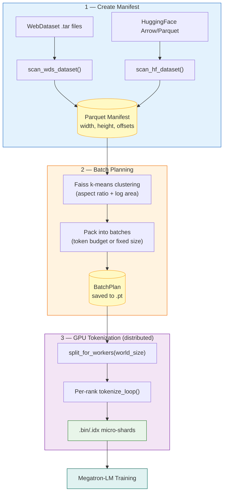

---

## 2. Create a Manifest

Before tokenizing, scan your dataset to create a **Parquet manifest** that indexes every image's location and dimensions. This is a one-time cost per dataset.

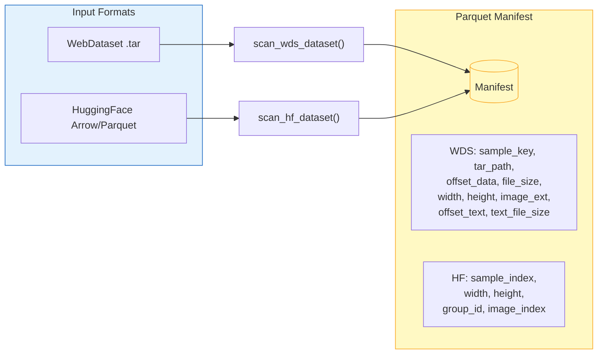

<details>
<summary><b>WebDataset example</b> — parallel scanning of tar files with optional text sidecars</summary>

```bash
python -c "
from vision_tokenization.indexing import scan_wds_dataset
scan_wds_dataset(
    input_pattern='/data/shards/{00000..01000}.tar',
    output_manifest='manifest.parquet',
    text_extensions=['json', 'txt'],  # optional: index text sidecars
    num_workers=64,
)
"
```

</details>

<details>
<summary><b>HuggingFace example</b> — header-only dimension extraction, parallel with Dataset.map</summary>

```bash
python -c "
from vision_tokenization.indexing import scan_hf_dataset
scan_hf_dataset(
    dataset_name='HuggingFaceM4/FineVision',
    output_manifest='manifest.parquet',
    image_column='image',
    image_list_column='images',  # optional: for multi-image datasets
    num_workers=8,               # parallel Dataset.map workers
)
"
```

</details>

---

## 3. Batch Planning — How Images Are Grouped

Images with similar aspect ratios and sizes are clustered together so every image in a batch resizes to the **same target dimensions**, minimizing wasted computation from padding.

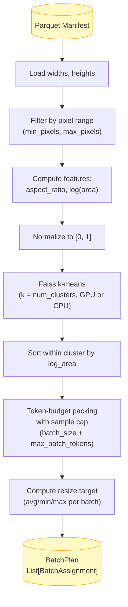

Each `BatchAssignment` contains:

| Field | Description |
|-------|-------------|
| `sample_indices` | Array of manifest row indices (one per image) |
| `resize_height` | Target resize height for all images in this batch |
| `resize_width` | Target resize width for all images in this batch |
| `group_slices` | Optional `(num_groups, 2)` array for multi-image datasets |

> [!TIP]
> The BatchPlan is **deterministic** and can be saved/reloaded via `torch.save()` for reuse across runs.

### Single-image vs Multi-image Clustering

The planner uses explicit `multi_image=True/False` (derived from `image_list_column` or `image_field_pattern` in the dataset config). If the manifest has a `group_id` column but `multi_image=False`, a warning is logged.

<details>
<summary><b>Single-image</b> — each image is its own clustering unit</summary>

```
Manifest rows:  img_A (800x600)  img_B (810x590)  img_C (200x200)  img_D (190x210)
                      |                |                |                |
Features:       (1.33, 12.7)     (1.37, 12.7)     (1.0, 10.6)      (0.9, 10.6)
                \_____________ cluster 0 __________/  \____________ cluster 1 _________/
                                  |                                  |
Batch 0:  sample_indices=[A, B]              Batch 1:  sample_indices=[C, D]
          resize_height=600                            resize_height=200
          group_slices=None                            group_slices=None
```

</details>

<details>
<summary><b>Multi-image</b> — entire groups are the clustering unit (never split)</summary>

```
Manifest rows:  group 0: img_A (800x600), img_B (810x590)    <- 2 images, 1 conversation
                group 1: img_C (200x200), img_D (190x210)    <- 2 images, 1 conversation
                                  |
Per-group features:  group 0 -> max dims (810, 600), total tokens = tok(A) + tok(B)
                     group 1 -> max dims (200, 210), total tokens = tok(C) + tok(D)
                                  |
                     k-means clusters groups, not images
                                  |
Batch 0:  sample_indices=[A, B]              Batch 1:  sample_indices=[C, D]
          resize_height=600                            resize_height=200
          group_slices=[[0, 2]]                        group_slices=[[0, 2]]
```

Groups are **atomic** — the packer never splits a group across batches. The `tokenize_batch()` interface is the same for both: when `group_slices is None`, each image is treated as its own trivial 1-image group.

</details>

---

## 4. Tokenization Modes

```mermaid
graph TB
    subgraph image_only["image_only — pretraining"]
        IO_In["PIL Image"] --> IO_Tok["EMUImageOnlyTokenizer"]
        IO_Tok --> IO_Out["[BOS] [img_struct] [EOS]"]
    end

    subgraph image2text["image2text — captioning"]
        I2T_Img["PIL Image"] --> I2T_Tok["EMUImageTextPairTokenizer"]
        I2T_Txt["Caption"] --> I2T_Tok
        I2T_Tok --> I2T_Out["[BOS] [img_struct] [text_tokens] [EOS]"]
    end

    subgraph text2image["text2image — generation"]
        T2I_Txt["Prompt"] --> T2I_Tok["EMUImageTextPairTokenizer"]
        T2I_Img["PIL Image"] --> T2I_Tok
        T2I_Tok --> T2I_Out["[BOS] [text_tokens] [img_struct] [EOS]"]
    end

    subgraph sft["sft — conversations"]
        SFT_Img["PIL Image"] --> SFT_Tok["EMUSftTokenizer"]
        SFT_Conv["Conversation"] --> SFT_Policy["ConversationPolicy"]
        SFT_Policy --> SFT_Tok
        SFT_Tok --> SFT_Out["[chat template with embedded<br/>vision tokens]"]
    end

    style image_only fill:#e3f2fd,stroke:#1565C0
    style image2text fill:#fff3e0,stroke:#EF6C00
    style text2image fill:#fce4ec,stroke:#C62828
    style sft fill:#f3e5f5,stroke:#7B1FA2
```

| Mode | Tokenizer | Text? | Input | Output |
|------|-----------|:-----:|-------|--------|
| `image_only` | [`EMUImageOnlyTokenizer`](./vokenizers/emu/image_only.py) | | Images | `[BOS] [img_struct] [EOS]` |
| `image2text` | [`EMUImageTextPairTokenizer`](./vokenizers/emu/image_text_pair.py) | Yes | Images + captions | `[BOS] [img_struct] [text] [EOS]` |
| `text2image` | [`EMUImageTextPairTokenizer`](./vokenizers/emu/image_text_pair.py) | Yes | Prompts + images | `[BOS] [text] [img_struct] [EOS]` |
| `sft` | [`EMUSftTokenizer`](./vokenizers/emu/sft.py) | Yes | Images + conversations | Chat template with vision tokens |

> [!NOTE]
> A single [`TokenizationHandler`](./pipelines/distributed/handler.py) drives all modes — `needs_text` is derived from the mode string. The handler is tokenizer-agnostic: any tokenizer implementing `tokenize_batch(images, resize_size, text=, group_slices=)` works.

---

## 5. Token Structure

Each image is encoded into a structured token sequence by [`encapsulate_image()`](./vokenizers/emu/image_only.py):

```
[BOS]
  [img_start]
    "32*32"                  <- dimension tokens (height x width as text)
    [img_token_start]
      [vis_tok_0 + offset]   <- row 1 vision tokens
      [vis_tok_1 + offset]
      ...
      [img_end_of_row]       <- row delimiter
      [vis_tok_N + offset]   <- row 2 vision tokens
      ...
      [img_end_of_row]
      ...                    <- all H rows
    [img_end_of_frame]
  [img_end]
[EOS]
```

> [!IMPORTANT]
> The `vision_token_offset` maps raw vision indices into the omni-tokenizer's unified vocabulary (e.g., vision token 100 becomes token ID `offset + 100`). This allows text, vision, and audio tokens to coexist in one vocabulary.

---

## 6. GPU Tokenization Loop

All modes share the same per-rank loop ([`tokenize_loop()`](./pipelines/distributed/core.py)): load batches via manifest indices, tokenize on GPU, write Megatron micro-shards, checkpoint periodically.

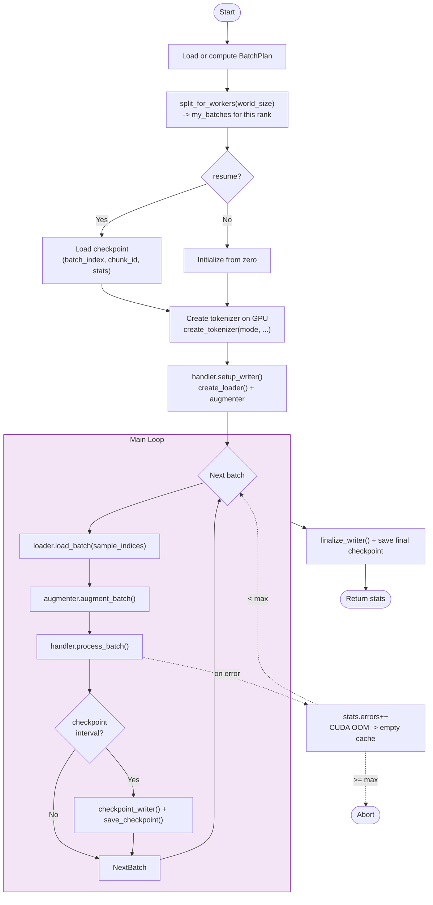

> [!TIP]
> **GPU/CPU bounce optimization** — Images are tokenized in batch on GPU, transferred to CPU once, then assembled with text tokens on CPU. This avoids per-sample GPU-CPU transfers.

> [!WARNING]
> **OOM prevention** — `tokenize_images()` chunks large multi-image batches into groups of `max_images_per_encode` images for the GPU encode call. If a batch still OOMs, it is skipped and the loop continues (up to `max_consecutive_errors`).

---

## 7. Data Loading

[`data.py`](./pipelines/distributed/data.py) provides two loaders, selected by `dataset_type`. Both return `(images, texts)` tuples via manifest row indices.

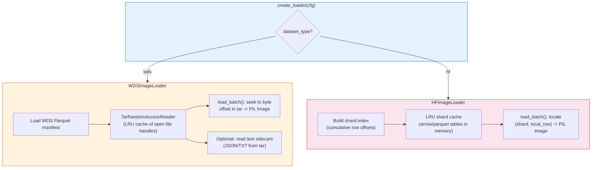

| Loader | Dataset type | Random access via | Text loading |
|--------|-------------|-------------------|-------------|
| `WDSImageLoader` | WebDataset `.tar` | Byte offset + file size from manifest | Text sidecars (`.json`/`.txt`) at indexed offsets |
| `HFImageLoader` | HuggingFace `.arrow`/`.parquet` | Shard index -> (shard_path, local_row) | Text column from same table |

---

## 8. Multi-Image Support

When a dataset has multiple images per sample (e.g., multi-image conversations), the manifest includes `group_id` and `image_index` columns. The batch planner produces `group_slices` that map groups to their images within the flat `sample_indices` array.

### Worked Example

A batch with 3 groups (2, 3, and 2 images respectively):

```
sample_indices = [42, 43,  70, 71, 72,  99, 100]
group_slices   = [[0, 2],  [2, 5],      [5, 7]]
                   ^ group 0  ^ group 1    ^ group 2
```

**Processing steps:**

| Step | Where | What |
|------|-------|------|
| 1 | GPU | All 7 images tokenized in one `tokenize_images()` call |
| 2 | CPU | Text tokenized separately (one text per group) |
| 3 | CPU | Per group, combine image + text tokens |
| 4 | Disk | One document per group (not per image) |

For **image2text** mode, each group assembles as:
```
[BOS] [img0_struct] [img1_struct] ... [text_tokens] [EOS]
```

For **SFT** mode, `<|image|>` placeholders in the conversation are replaced with vision tokens via [`_replace_images()`](./vokenizers/emu/sft.py).

---

## 9. SFT Conversation Flow

SFT datasets store conversations in many different formats. The [`ConversationPolicy`](./vokenizers/conversation_policy.py) auto-detects and normalizes them before tokenization.

```mermaid
flowchart LR
    subgraph Input
        RAW["Raw conversation<br/>(any format)"]
    end

    subgraph Normalize["ConversationPolicy"]
        DET["Auto-detect format:<br/>role/content | from/value<br/>| user/assistant pairs"]
        MAP["Map roles via role_map<br/>(human->user, gpt->assistant)"]
        SYS["Optionally add<br/>empty system message"]
        IMG["Optionally prepend<br/>image placeholder"]
        DET --> MAP --> SYS --> IMG
    end

    subgraph Tokenize_SFT["EMUSftTokenizer"]
        CHAT["Apply chat template"]
        TOK_TEXT["Tokenize text on CPU<br/>(find &lt;|image|&gt; positions)"]
        TOK_IMG["Tokenize image on GPU<br/>(strip per-image BOS/EOS)"]
        REPLACE["Replace placeholder tokens<br/>with vision tokens"]
        CHAT --> TOK_TEXT
        TOK_IMG --> REPLACE
        TOK_TEXT --> REPLACE
    end

    RAW --> DET
    IMG --> CHAT
    REPLACE --> FINAL["Final token sequence"]

    click DET href "https://github.com/swiss-ai/benchmark-image-tokenzier/blob/main/vision_tokenization/vokenizers/conversation_policy.py"
    click REPLACE href "https://github.com/swiss-ai/benchmark-image-tokenzier/blob/main/vision_tokenization/vokenizers/emu/sft.py"

    style Input fill:#e3f2fd,stroke:#1565C0
    style Normalize fill:#fff3e0,stroke:#EF6C00
    style Tokenize_SFT fill:#f3e5f5,stroke:#7B1FA2
```

**Supported input formats** (auto-detected from the first message):

| Format | Example |
|--------|---------|
| `role/content` | `[{"role": "user", "content": "..."}, {"role": "assistant", "content": "..."}]` |
| `from/value` | `[{"from": "human", "value": "..."}, {"from": "gpt", "value": "..."}]` |
| `user/assistant` pairs | `[{"user": "...", "assistant": "..."}]` |

---

## 10. Checkpointing and Output

Each rank writes independent micro-shards — no inter-rank coordination needed. See [`checkpoint.py`](./pipelines/distributed/checkpoint.py).

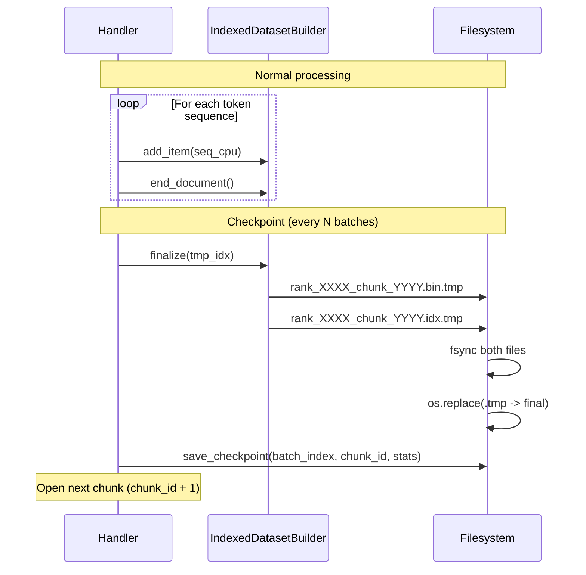

<details>
<summary><b>Output directory layout</b></summary>

```
output_dir/{mode}/{output_name}/
+-- rank_0000_chunk_0000.bin     # Token data (Megatron MMIDIDX binary)
+-- rank_0000_chunk_0000.idx     # Index for random access
+-- rank_0000_chunk_0001.bin
+-- rank_0000_chunk_0001.idx
+-- rank_0000_checkpoint.pt      # Resume state
+-- rank_0001_chunk_0000.bin
+-- rank_0001_chunk_0000.idx
+-- rank_0001_checkpoint.pt
+-- ...
```

</details>

| Property | Detail |
|----------|--------|
| **Atomic writes** | `.tmp` suffix during write, `os.replace()` to final name |
| **fsync** | Ensures durability on network filesystems (Lustre) |
| **Deterministic resume** | BatchPlan is deterministic; checkpoint = `(batch_index, chunk_id)` |
| **Document boundaries** | One document per image (single-image) or per group (multi-image) |

---

## 11. Multi-GPU Distribution

Each rank processes an independent subset of batches — **no NCCL, no inter-rank communication**. See [`__init__.py`](./pipelines/distributed/__init__.py) and [`core.py`](./pipelines/distributed/core.py).

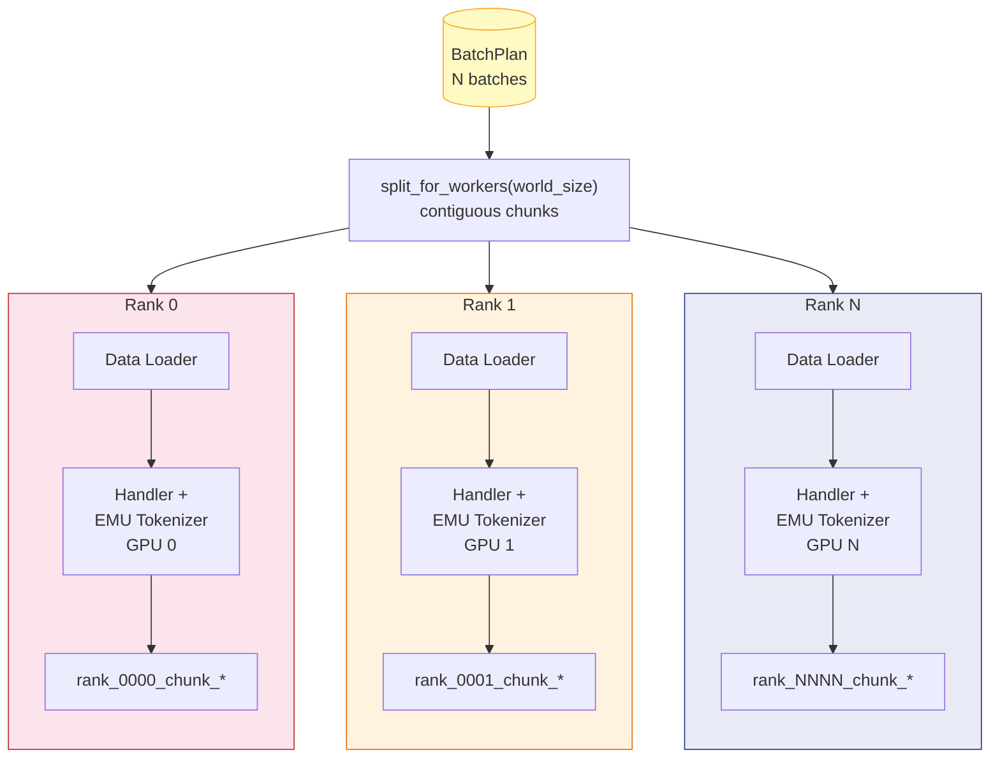

---

## 12. Class Hierarchy

### Tokenizers ([`vokenizers/emu/`](./vokenizers/emu/))

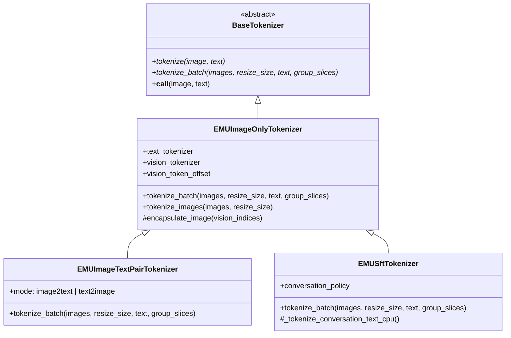

> [!NOTE]
> New tokenizer families (Cosmos, Chameleon, ...) subclass `BaseTokenizer` and implement `tokenize_batch()` — the `TokenizationHandler` works with any of them.

### Handler + Writer ([`pipelines/distributed/`](./pipelines/distributed/))

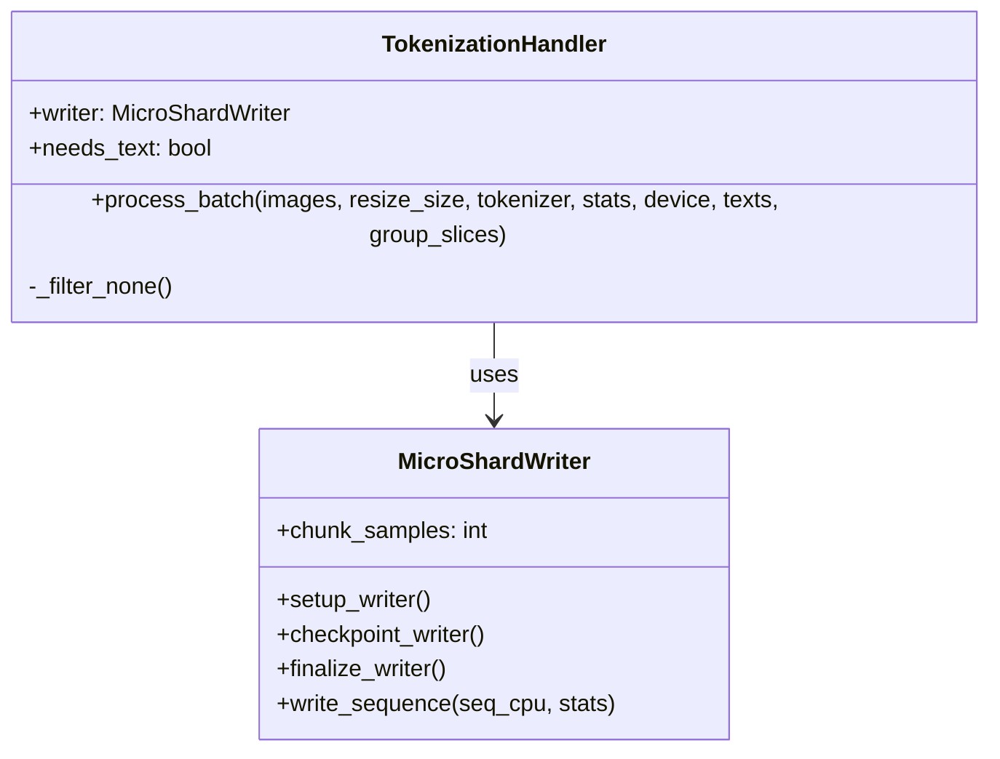

`TokenizationHandler` is tokenizer-agnostic — it calls `tokenizer.tokenize_batch()` and writes results via `MicroShardWriter`. Any tokenizer implementing `BaseTokenizer.tokenize_batch()` works.

---

## 13. Configuration (Hydra)

The pipeline uses [Hydra](https://hydra.cc/) for hierarchical configuration. The main config composes a dataset sub-config via the `defaults` list, and every field can be overridden from the CLI.

<details>
<summary><b>Config directory structure</b></summary>

```
configs/
+-- config.yaml                   # Main: mode, tokenizer, W&B, resume
+-- dataset/
    +-- image_only/
    |   +-- llava85m_midtrain.yaml
    |   +-- ...
    +-- sft/
    |   +-- llava_onevision_sft.yaml
    |   +-- ...
    +-- image2text/
    |   +-- ...
    +-- text2image/
        +-- ...
```

</details>

### Main config ([`config.yaml`](./configs/config.yaml))

| Key | Description | Default |
|-----|-------------|---------|
| `mode` | `image_only`, `sft`, `image2text`, or `text2image` | `image_only` |
| `tokenizer.path` | Path to omni-tokenizer (vision tokenizer auto-loaded from config) | required |
| `tokenizer.min_pixels` | Minimum pixels for image preprocessing | `"128*128"` |
| `tokenizer.max_pixels` | Maximum pixels for image preprocessing | `"1400*1400"` |
| `tokenizer.max_images_per_encode` | Max images per GPU encode call; larger batches are chunked to avoid OOM | `16` |
| `num_gpus` | Total GPU count (cross-checked against `SLURM_NTASKS`) | required |
| `resume` | Resume from rank checkpoints | `false` |
| `dry_run` | Estimate tokens without GPU | `false` |
| `checkpoint_interval_batches` | How often to write rank checkpoints | `1000` |
| `wandb.*` | Weights & Biases logging settings | enabled |

### Dataset configs

| Key | Description |
|-----|-------------|
| `dataset_type` | `wds` (WebDataset tars) or `hf` (HuggingFace Arrow) |
| `output_name` | Name for output subdirectory |
| `manifest_path` | Path to Parquet manifest |
| `arrow_dir` | Path to HF arrow/parquet files (HF only) |
| `image_column` / `text_column` | Column names in the dataset |
| `max_batch_tokens` | Token budget per batch (required) |
| `batch_size` | Max samples per batch (required, acts as sample cap) |
| `spatial_factor` | Vision tokenizer spatial downsampling factor (default 16) |
| `num_clusters` | k-means cluster count for batch planning (default 2000) |
| `conversation_policy.*` | SFT conversation normalization (SFT mode only) |

---

## 14. CLI Usage

```bash
# Single node, 4 GPUs (torchrun)
CUDA_VISIBLE_DEVICES=0,1,2,3 torchrun --nproc_per_node=4 \
    -m vision_tokenization.tokenize \
    dataset=image_only/my_dataset num_gpus=4 \
    output_dir=/output/path tokenizer.path=/path/to/omni-tokenizer
```

<details>
<summary><b>More launch examples</b></summary>

```bash
# Single node, 4 GPUs (srun)
srun --ntasks-per-node=4 --gpus-per-node=4 \
    python -m vision_tokenization.tokenize \
    dataset=image_only/my_dataset num_gpus=4 \
    output_dir=/output/path tokenizer.path=/path/to/omni-tokenizer

# Multi-node (4 nodes x 4 GPUs = 16 GPUs)
srun --nodes=4 --ntasks-per-node=4 --gpus-per-node=4 \
    python -m vision_tokenization.tokenize \
    dataset=sft/llava_onevision_sft num_gpus=16 \
    output_dir=/output/path tokenizer.path=/path/to/omni-tokenizer

# Resume from checkpoint
CUDA_VISIBLE_DEVICES=0,1,2,3 torchrun --nproc_per_node=4 \
    -m vision_tokenization.tokenize \
    dataset=image_only/my_dataset num_gpus=4 resume=true

# Dry run (estimate tokens, no GPU needed)
python -m vision_tokenization.tokenize \
    dataset=image_only/my_dataset dry_run=true

# Override any config field from CLI
CUDA_VISIBLE_DEVICES=0,1,2,3 torchrun --nproc_per_node=4 \
    -m vision_tokenization.tokenize \
    dataset=sft/llava_sft num_gpus=8 \
    dataset.max_batch_tokens=25600 \
    dataset.checkpoint_interval_batches=200
```

</details>

---

## 15. Directory Structure

```
vision_tokenization/
+-- tokenize.py                          # Hydra entry point
+-- configs/
|   +-- config.yaml                      # Main config
|   +-- dataset/                         # Per-dataset configs (nested by mode)
|
+-- indexing/                            # Manifest creation + batch planning
|   +-- scanner_wds.py                   # Scan tar files -> Parquet manifest
|   +-- scanner_hf.py                    # Scan HF datasets -> Parquet manifest
|   +-- manifest.py                      # Parquet schema + I/O helpers
|   +-- reader.py                        # TarRandomAccessReader (LRU cache)
|   +-- clustered_batch_planner.py       # k-means -> BatchPlan
|   +-- _scan_worker.py                  # Parallel tar scanning logic
|
+-- pipelines/distributed/               # torch.distributed pipeline
|   +-- __init__.py                      # run_distributed_pipeline()
|   +-- core.py                          # tokenize_loop() -- main per-rank loop
|   +-- handler.py                       # TokenizationHandler (tokenizer-agnostic)
|   +-- writer.py                        # MicroShardWriter (micro-shard lifecycle)
|   +-- checkpoint.py                    # Micro-shard I/O, WorkerStats, W&B
|   +-- data.py                          # WDSImageLoader, HFImageLoader, augmenter
|   +-- dry_run.py                       # Token estimation without GPU
|
+-- vokenizers/                          # Tokenizer implementations
|   +-- base.py                          # BaseTokenizer ABC (tokenize + tokenize_batch)
|   +-- conversation_policy.py           # SFT conversation normalization
|   +-- emu/
|       +-- __init__.py                  # create_tokenizer() factory
|       +-- image_only.py               # EMUImageOnlyTokenizer
|       +-- image_text_pair.py          # EMUImageTextPairTokenizer
|       +-- sft.py                      # EMUSftTokenizer
|
+-- utils/
    +-- ...                              # Miscellaneous utilities
```

---

## 16. Key Design Decisions

| Decision | Rationale |
|----------|-----------|
| **No NCCL** | Each rank is independent — BatchPlan provides deterministic work assignment, no inter-GPU communication needed |
| **Batch-index checkpointing** | BatchPlan is deterministic, so checkpoint = `(batch_index, chunk_id)` — no sampler state |
| **GPU/CPU bounce** | Images tokenized in batch on GPU, transferred to CPU once, assembled with text on CPU — avoids per-sample transfers |
| **Clustered batching** | k-means on (aspect_ratio, log_area) groups similar images -> same resize target -> no padding waste |
| **Atomic file writes** | `.tmp` + `os.replace()` pattern for crash safety on network filesystems |
| **Tokenizer-agnostic handler** | Single `TokenizationHandler` for all modes — `needs_text` derived from mode string, tokenizer only needs `tokenize_batch()` |
| **Micro-sharding** | Output partitioned by `rank_XXXX_chunk_YYYY` — deterministic restart, no merge step needed |

---

## 17. Profiling

See [`profile/README.md`](./profile/README.md) for Emu3.5 VQ encoder profiling results on GH200 120GB:

| Metric | Value |
|--------|-------|
| **Bottleneck** | encode (VQ forward pass) at ~92% of wall time |
| **Hottest kernel** | SpatialSoftMax (~26% GPU time, fp32, architectural) |
| **OOM boundary** | batch=64 @ 512x512, batch=16 @ 768x768 |

> [!TIP]
> **Recommended settings**: `max_batch_tokens=32768`, `batch_size=32`, `max_images_per_encode=16` — 99.5% peak throughput with 30% VRAM headroom.

---

## TODO

- [ ] **URL-based robots.txt filtering in manifest** — filter out samples whose source URLs are disallowed by robots.txt during manifest creation
- [ ] **SFT conversation parsing** — improve conversation format detection and normalization to handle more edge cases and structured content
- [ ] **Sequence-length-based split writing** — split output micro-shards by sequence length so longer sequences can be reserved for long-context training phases
