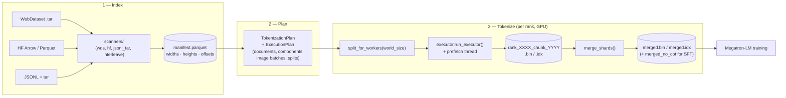

<div align="center">

# Vision Tokenization Pipeline

**Distributed GPU tokenization for vision datasets — WebDataset and HuggingFace into Megatron `.bin/.idx` shards.**

</div>

<table>
<tr>
<td width="50%">

**Inputs**
- WebDataset `.tar` archives (with optional text/JSON sidecars)
- HuggingFace Arrow / Parquet datasets
- JSONL+tar interleaved documents

</td>
<td width="50%">

**Output**
- Megatron `IndexedDataset` micro-shards (`MMIDIDX` magic)
- One file pair per `(rank, chunk)`, then merged
- Deterministic and resumable; no NCCL between ranks

</td>
</tr>
<tr>
<td>

**Tokenizers**
- EMU family (`Emu3`, `Emu3.5`) under `discrete/emu/`
- Pluggable by implementing `tokenize_batch(...)`

</td>
<td>

**Modes** (factory: `discrete/emu/__init__.py`)
- `image_only`, `image2text`, `text2image`
- `sft` (multi-turn conversations)
- `interleave` (multi-modal documents)

</td>
</tr>
</table>

---

## Contents

1. [Pipeline at a glance](#1-pipeline-at-a-glance)
2. [Quickstart](#2-quickstart)
3. [Modes](#3-modes)
4. [Architecture](#4-architecture)
5. [Design rationale](#5-design-rationale)
6. [Configuration](#6-configuration)
7. [Output format and merge](#7-output-format-and-merge)
8. [Pointers](#8-pointers)

---

## 1. Pipeline at a glance

Three stages. The first two run once per dataset; the third is the
distributed loop that runs every time you tokenize.


```mermaid
graph LR
    subgraph Index["1 — Index"]
        TAR["WebDataset .tar"]
        HF["HF Arrow / Parquet"]
        JSONL["JSONL + tar"]
        TAR & HF & JSONL --> SCAN["scanners/<br/>(wds, hf, jsonl_tar, interleave)"]
        SCAN --> MAN[("manifest.parquet<br/>widths · heights · offsets")]
    end

    subgraph Plan["2 — Plan"]
        MAN --> TP["TokenizationPlan<br/>+ ExecutionPlan<br/>(documents, components,<br/>image batches, splits)"]
    end

    subgraph Run["3 — Tokenize (per rank, GPU)"]
        TP --> SPLIT["split_for_workers(world_size)"]
        SPLIT --> EXE["executor.run_executor()<br/>+ prefetch thread"]
        EXE --> SHARDS[("rank_XXXX_chunk_YYYY<br/>.bin / .idx")]
        SHARDS --> MERGE["merge_shards()"]
        MERGE --> OUT[("merged.bin / merged.idx<br/>(+ merged_no_cot for SFT)")]
    end

    OUT --> TRAIN["Megatron-LM training"]
```

The plan is the **single source of truth**: ranks never coordinate at
runtime. They each own a contiguous slice of batches, write
independently, and the merge step stitches the shards together when all
ranks have finished.

---

## 2. Quickstart

The Hydra entry point is `vision_tokenization.tokenize`, configured under
`vision_tokenization/configs/`. The shorthand `mode=X dataset=Y` is
rewritten to `dataset=X/Y` before Hydra parses it (see
`tokenize.py:_preprocess_dataset_override`).

**From the login node (the normal path) — submit a Slurm wrapper:**

```bash
sbatch scripts/slurm/tokenize/image2text/docci.slurm
```

Every dataset has a wrapper under `scripts/slurm/<dataset>.slurm` that
declares its container TOML via `#SBATCH --environment=...`, exports
`NUM_GPUS = nodes × ntasks-per-node`, and srun's:

```bash
python -m vision_tokenization.tokenize \
    mode=image2text dataset=docci \
    num_gpus=$NUM_GPUS wandb.enabled=true resume=true
```

That second snippet is also what you run **inside an interactive
container session** for debugging — e.g. `srun --pty --environment=...`
on a single node — but it cannot be run directly from a login node
because `/opt/venv` and the GPU drivers live inside the container, not
on login.

The merge step is a separate cpu-only job. Submit it with an `afterany`
dependency so it still runs when tokenization exits on a benign signal
(e.g. SIGTERM at time limit) — the merge itself fails cleanly if shards
are incomplete:

```bash
JOBID=$(sbatch --parsable scripts/slurm/tokenize/image2text/docci.slurm)
SRC=/.../tokenized/image2text/docci RANKS=4 \
    sbatch --dependency=afterany:$JOBID scripts/slurm/ops/merge.slurm
```

`merge.slurm` preserves CoT by default; pass `STRIP_THINKING=true` to
additionally emit `OUT_no_cot.{bin,idx}` with `<think>…</think>` spans
removed (SFT only — a no-op for non-conversational modes). Pass `DEST=`
to place the merged `OUT.{bin,idx}` under a canonical dataset dir.

---

## 3. Modes

| Mode | Tokenizer class | Input shape | Output sequence |
|---|---|---|---|
| `image_only` | `EMUImageOnlyTokenizer` | images | `[BOS] [vision tokens] [EOS]` |
| `image2text` | `EMUImageTextPairTokenizer` | image + caption | `[BOS] [vision] [text] [EOS]` |
| `text2image` | `EMUImageTextPairTokenizer` | prompt + image | `[BOS] [text] [vision] [EOS]` |
| `sft` | `EMUSftTokenizer` | image(s) + multi-turn conversation | chat template with embedded vision spans |
| `interleave` | `EMUInterleaveTokenizer` | streaming multi-modal document | image/text segments interleaved per source order |

Vision tokens live in a contiguous range above the text vocabulary; the
offset comes from the tokenizer's vision sub-tokenizer config and is
applied inside `discrete/emu/image_only.py`.

### Conversation policy (SFT only)

`ConversationPolicy` (`discrete/conversation.py`) is the one place where
SFT datasets diverge — every dataset arrives in a slightly different
schema. The policy auto-detects the input format and then applies four
optional normalisations.

**Three input schemas detected** by `_normalize`:

| Schema | Example shape | Source convention |
|---|---|---|
| `{role, content}` | `[{"role": "user", "content": "…"}]` | canonical / OpenAI-style |
| `{from, value}` | `[{"from": "human", "value": "…"}]` | ShareGPT, LLaVA |
| `{user, assistant}` | `[{"user": "…", "assistant": "…"}]` | paired turns; expanded into role/content |

**Four policy fields** (all optional):

```yaml
conversation_policy:
  role_map:                       # rename non-standard roles
    human: user                   # default mapping; override for exotic schemas
    gpt: assistant
  add_system_message: false       # prepend `{"role":"system","content":""}` if absent
  add_image_placeholder: false    # prepend image_placeholder to first user message
  image_placeholder: "<image>"    # the placeholder string
```

Real-world examples from `configs/dataset/sft/`:

| Dataset | Policy | Why |
|---|---|---|
| `path_vqa`, `pixmo_ask_model_anything`, `bigearthnet` | `add_image_placeholder: true` | dataset omits `<image>` from the user turn |
| `llava_onevision_sft` | `add_image_placeholder: true` + `add_system_message: true` | needs both injected |
| `google_rsrcc` | `add_image_placeholder: false` | source already includes `<image>` |
| `radimgnet_vqa`, `pixmo_cap_qa` | (block present, all defaults) | role schema is canonical, no injection needed |

**Edges and gotchas.** Reading `discrete/conversation.py` carefully reveals
behaviours that are easy to miss but often the cause of mysterious SFT
failures:

- **Format detection is on the *first* message only.** `_normalize`
  inspects `raw_messages[0]`'s keys (line 86 onward) and commits the
  whole conversation to that schema. Mixed-schema conversations (e.g.
  ShareGPT with a stray `{"role","content"}` dict somewhere in the
  middle) raise from `_from_fields`/`_from_pairs` rather than degrade
  gracefully. Auto-detection priority: `{user, assistant}` →
  `{role, content}` → `{from, value}`.

- **Unknown roles pass through unchanged.** `role_map.get(str(role),
  str(role))` (line 122) keeps any role string the dataset uses if it's
  not in the map. Datasets with `"observation"`, `"function"`,
  `"tool"`, etc. won't fail in normalization — they fail later in
  `render_sft_document` with a less obvious error. Add custom roles to
  `role_map` explicitly if you see this.

- **`add_image_placeholder` only touches the *first* user message.**
  `_prepend_image` returns after the first `role == "user"` it finds
  (line 157). Multi-image conversations with images referenced in
  later turns must include `<image>` markers in the source — the
  policy will not insert them.

- **String vs structured content asymmetry.** For string content the
  check is `not content.startswith(placeholder)` — duplicate-safe. For
  list content (OpenAI multimodal-style) the check is *"is there an
  `{"type":"image"}` part anywhere?"* — so a `[{"type":"text","text":
  "<image> hello"}]` would not be detected as already having an image
  marker, and a second placeholder dict gets prepended. Pick one
  content shape per dataset and stick to it.

- **`add_system_message` only checks position 0.** A stray system
  message at index ≥ 1 will not block prepending a new empty system
  message at index 0 — you'd end up with two. Most datasets are fine;
  worth knowing if yours has system turns mid-conversation.

- **Image-count enforcement is downstream.** `apply_conversation_policy`
  does not validate that the number of `<image>` markers equals the
  number of images in the batch group. That check happens in
  `render_sft_document` (`discrete/emu/sft.py:209`) via
  `expected_num_images = ge - gs`. The canonical signal:
  *"Rendered chat contains no recognized image marker"* → enable
  `add_image_placeholder: true`. Mismatched count → fix the source
  conversation, not the policy.

- **Hydra `dict` → `ConversationPolicy` conversion happens once.** The
  `dict → ConversationPolicy(**dict)` cast lives in `tokenize.py` (grep
  for `ConversationPolicy(**`). Don't replicate it in handlers or
  worker code — the dataclass is what flows past the entry point.

---

## 4. Architecture

The code is organised so each layer is replaceable. New formats need a
scanner; new tokenizer families need a class with `tokenize_batch(...)`;
the runtime and writer don't care which.

### 4.1 Manifest

`indexing/manifest.py` defines a Parquet schema with widths, heights,
and byte offsets. Scanners under `indexing/scanners/` populate it:

| Scanner | Function | For |
|---|---|---|
| `scanners/wds.py` | `scan_wds_dataset` | WebDataset tars (with optional text sidecars in `WDS_SCHEMA_WITH_TEXT`) |
| `scanners/hf.py` | `scan_hf_dataset` | HuggingFace Arrow / Parquet |
| `scanners/jsonl_tar.py` | `scan_jsonl_tar_dataset` | JSONL with referenced tar offsets |
| `scanners/interleave.py` | `scan_jsonl_tar_interleave_dataset` | Interleaved documents |

The manifest is treated as immutable: regenerating it is cheap and
guarantees consistency between cluster nodes that read from shared
storage.

### 4.2 Plan

`indexing/planning/tokenization_plan.py` defines `TokenizationPlan` and
`ExecutionPlan`. The split is intentional:

- **Logical state** — documents and components. Identity is
  `(document_id, component_index)`. Components are typed `IMAGE` or
  `TEXT`.
- **Execution state** — image batches and rank-safe split boundaries.
  Batches are packed by token budget (default `max_batch_tokens=32_768`)
  and grouped by aspect ratio so a batch's smart-resize dimensions are
  homogeneous.

`split_for_workers(world_size)` produces a contiguous slice of batches
for each rank. The slice is cost-weighted, so a rank loaded with high-
resolution images gets fewer batches than a rank loaded with thumbnails.

### 4.3 Tokenizer factory + handler

The factory returns a single object that exposes one method,
`tokenize_batch(images, resize_size, text=, group_slices=)`:

```python
from vision_tokenization.discrete.emu import create_tokenizer

tokenizer = create_tokenizer(
    mode="image2text",
    text_tokenizer_path="/.../apertus_emu3.5_wavtok",
    min_pixels=128 * 128,
    max_pixels=1400 * 1400,
)
```

Internally the factory dispatches `image_only` → `EMUImageOnlyTokenizer`,
`{image2text, text2image}` → `EMUImageTextPairTokenizer`, `sft` →
`EMUSftTokenizer`, `interleave` → `EMUInterleaveTokenizer`. The runtime
contract is the `tokenize_batch(...)` method.

The runtime never touches a tokenizer-specific class. It calls the
`TokenizationHandler` in `pipeline/output/direct/handler.py`, which:

1. drops `None` images (decode failures),
2. calls `tokenizer.tokenize_batch(...)`,
3. forwards sequences to `MicroShardWriter`,
4. accumulates per-batch `WorkerStats`.

`needs_text` — whether a mode requires a text sidecar — is derived from
the mode string at construction time.

### 4.4 Distributed loop

Entry: `pipeline/__init__.py:run_distributed_pipeline` →
`pipeline/runtime/executor.py:run_executor`. Each rank:

1. Reads `RANK / WORLD_SIZE / LOCAL_RANK` from `torchrun` or
   `SLURM_PROCID / SLURM_NTASKS / SLURM_LOCALID`. There is **no
   `init_process_group`** — ranks are independent.
2. Loads (or rebuilds) the plan and takes its `split_for_workers` slice.
3. Spawns a background prefetch thread (`pipeline/runtime/prefetch.py`)
   that overlaps tar/Arrow I/O with GPU encoding through a bounded queue.
4. Iterates batches: decode → tokenize → write → checkpoint.
5. On exit, calls `maybe_merge_shards` — the last rank to observe a
   complete checkpoint set performs the merge inline; the others return
   immediately.

Per-batch metrics (samples, tokens, throughput) stream to W&B when
`wandb.enabled=true`. Per-rank stats files are reduced into a global
report in `pipeline/output/`.

### 4.5 Resume and checkpointing

Checkpointing is **batch-index based**: each rank writes
`rank_XXXX_chunk_YYYY.{bin,idx}` plus a small JSON checkpoint that
records the highest batch index it has fully written. Resuming with
`resume=true` reloads the plan, fast-forwards to the next un-written
batch, and continues. Writes go through `os.replace()` on `.tmp` files
for atomicity, with explicit `fsync` for Lustre durability.

---

## 5. Design rationale

Four choices that aren't obvious from reading the code top-down. Each one
is a deliberate response to a measured cost.

### 5.1 GPU image encode runs in parallel with CPU text work — in every multimodal mode

`image_only` has no text, so it's pure GPU. **Every other mode**
(`image2text`, `text2image`, `sft`, `interleave`) wraps the image encode
and the text-side work in a `ThreadPoolExecutor.submit` pair and awaits
both:

```python
# discrete/emu/image_text_pair.py:78  (and analogous in sft.py, interleave.py)
image_future = self.executor.submit(self.tokenize_images, images, resize_size)
text_future  = self.executor.submit(tokenize_texts_cpu)
image_tokens_batch = image_future.result()
text_tokens_list   = text_future.result()
```

The first principle: image encoding is the dominant cost (the GH200
profile attributes ~92% of the encode batch to the vision encoder,
hottest kernel `SpatialSoftMax` at 26%); CPU-side text tokenization or
chat-template rendering is essentially free. Serialising them would
leave the CPU idle during the encode and the GPU idle during text
work — overlapping makes both costs the cost of the *larger* one.
It works without explicit synchronization because both submitted
callables release the GIL inside their C/C++ extensions: the CUDA
launches in `tokenize_images` and the HuggingFace fast tokenizer in
`tokenize_texts_cpu` proceed in genuine parallel on the two pool
threads.

SFT does *more* CPU work than image2text (chat-template rendering plus
text tokenization), which is precisely the case where the overlap
matters most.

### 5.2 `torch.compile` is opt-in and off by default

It's plumbed only into the Emu3.5 (IBQ) tokenizer
(`discrete/emu/image_only.py:88-94`) and the config defaults to
`torch_compile: false`. The reasoning is shape-driven:

- Batches in this pipeline have **non-stationary shapes**. The planner
  groups by `(final_h, final_w)` resolution key within a window
  (`_plan_image_batches` sorts by `keys = final_h * 100_000 + final_w`),
  but successive batches across a rank's slice can pick different keys.
  Every new shape triggers a recompile under `mode="reduce-overhead"` /
  `"max-autotune"`, and recompile cost dominates for short jobs.
- The encoder is already a single forward of a heavy convolutional VQ
  stack — Python-side launch overhead is amortised over large CUDA
  kernels, so compile's main lever (kernel fusion + reduced launch
  overhead) yields only a few percent.
- The pipeline is embarrassingly parallel and bound by GPU encode time
  (see §4.4). A few-percent kernel speedup that comes with recompile
  spikes is a net loss for a job that finishes in tens of minutes.

Turn it on (`tokenizer.torch_compile=true`) only when you've pinned a
single resolution (large `min_pixels`/`max_pixels` band collapsed to
near-equal) and the job is long enough to amortise warmup.

### 5.3 Three stages (`manifest → plan → tokenize`) instead of one

The pipeline could just iterate the dataset and tokenize on the fly.
It doesn't, because each stage has a different cost profile and a
different failure mode:

| Stage | Cost | Frequency | Failure mode |
|---|---|---|---|
| **Scan** → manifest | minutes by default; optional raw-byte SHA reads media bytes | once per dataset version | wrong dataset path; partial scan |
| **Plan** → batch + split | seconds (numpy-only, no I/O, no GPU) | once per `(batch_size, max_batch_tokens, world_size)` | bad cost weights → idle ranks |
| **Tokenize** → micro-shards | hours, GPU-bound | every run, possibly resumed | OOM; storage hiccup |

> **Scanning is intentionally cheap by default.** The scanners (`indexing/scanners/wds.py`,
> `hf.py`, `jsonl_tar.py`, `interleave.py`) drive a `ProcessPoolExecutor`
> via `_parallel.run_ordered_pool` (default 64 workers, in-flight cap
> `2 × num_workers`). A WDS scan reads only the **tar header chain** —
> never the image bytes — recording `(sample_key, tar_path, offset_data,
> file_size, width, height)` per record. This makes the scan I/O-bound
> on tar TOC reads, parallel across hundreds of shards: hundreds of
> millions of samples scan in O(minutes), not O(hours). A re-scan after
> ingesting a new dataset version costs less than a single tokenization
> rank's startup overhead. Set `compute_media_sha256: true` in a dataset
> config, or pass `compute_media_sha256=True` to a scanner, to append
> `media_sha256: binary(32)` for exact raw-byte deduplication. That mode
> intentionally reads the encoded media payload, but keeps the default
> manifest schema unchanged.

Decoupling means:

- **Re-tokenizing the same dataset** with a different batch size or
  rank count costs *seconds* of replanning, not minutes of rescan.
- **Resume is `argmax(rank_*_chunk_*.idx) + 1`** — no sampler state, no
  RNG state, no walltime fragility, because the plan is deterministic.
- **Dry-run** (`dry_run=true`) loads the plan and prints
  `total_documents`, `total_batches`, `total_image_tokens` *without
  loading a GPU* (`pipeline/__init__.py:50`). Bugs in batching are
  caught before burning compute.
- **Cost weights are the only knob the planner exposes** —
  `weighted_contiguous_split` consumes them and produces rank slices
  that stay within ~1.5 % wallclock spread across ranks (measured at
  1.23 % on 4-rank `bigearthnet`, 1.61 % on 4-rank `google_rsrcc`).

The contract: `(document_id, component_index)` is the only logical
identity. Execution-state fields (batch assignment, rank assignment)
never define identity, so re-planning is always safe.

### 5.4 Locality is what makes throughput work

A WDS tar is typically 1–50 GB and holds 10k–100k images. On Lustre,
`open()` + initial seek is the expensive operation; sequential
`pread()` after that is bandwidth-bound. The pipeline is aggressive
about exploiting that asymmetry:

1. **Window-based batching** (`_plan_image_batches`, line 360+).
   Components are bucketed by `manifest_row // window_size` so each
   window covers a contiguous slice of the source — and the manifest
   was written in tar-traversal order, so a contiguous slice typically
   lives in a small set of tars.
2. **Window boundaries snap to document boundaries** (line 369–373).
   Without this, a multi-image SFT document could be split across
   ranks, forcing cross-rank coordination at runtime — which we don't
   have.
3. **Rank splits cut on window boundaries** — every rank reads from
   contiguous manifest rows, so each rank touches O(1) tars per batch
   instead of O(batch_size).
4. **Per-thread LRU of open file handles** in `TarRandomAccessReader`
   (`indexing/reader.py:65`, default 32 handles per thread). With
   contiguous reads, the LRU rarely evicts; with random reads, it
   thrashes. The architecture chooses the regime that lets the simple
   cache work.
5. **Within a window, sort by resolution key** before greedy-packing
   batches. This keeps each batch shape-uniform (better GPU memory
   utilisation, no padding waste) *and* keeps adjacent images
   byte-adjacent inside the same tar (free OS read-ahead).

The payoff is concrete: I/O drops out of the critical path, so the GPU
encode becomes the bottleneck — which is the regime the §4 prefetcher
and the §5.1 GPU/CPU overlap are tuned for. Break locality (random
shuffling, e.g.) and the same job becomes I/O-bound on tar opens
instead, with the LRU thrashing and the GPU idle.

---

## 6. Configuration

`configs/config.yaml` is the root. It composes one dataset config from
`configs/dataset/{mode}/{name}.yaml`, plus the shared bases under
`configs/dataset/_pipeline.yaml`, `_storage/`, and `_task/`.

```
configs/
├── config.yaml                   # tokenizer path, wandb, resume, merge_shards, …
└── dataset/
    ├── _pipeline.yaml            # pipeline defaults (prefetch, num_workers, …)
    ├── _storage/                 # storage adapters: hf, wds, jsonl_tar
    ├── _task/                    # task defaults: image_only, sft, image2text, text2image, interleave
    ├── image_only/    (≈39 yamls)
    ├── image2text/    (≈28 yamls)
    ├── sft/           (≈14 yamls)
    └── interleave/    (≈10 yamls)
```

> `text2image` is supported by the factory but currently has no dataset
> configs — add one under `configs/dataset/text2image/` when needed.

Override anything from the CLI:

```bash
python -m vision_tokenization.tokenize \
    mode=sft dataset=bigearthnet \
    num_gpus=8 \
    dataset.max_batch_tokens=32_768 \
    tokenizer.max_pixels="2048*2048" \
    wandb.enabled=true
```

A typical dataset YAML inherits the right `_storage` and `_task` bases
and only specifies dataset-specific paths and limits:

```yaml
defaults:
  - /dataset/_pipeline@_here_
  - /dataset/_storage/wds@_here_
  - /dataset/_task/sft@_here_

output_name: bigearthnet
output_dir: /capstor/.../tokenized
input_pattern: "/.../bigearthnet-all-*.tar"
manifest_path: /.../manifests/bigearthnet/manifest.parquet

text_column: conversations
conversation_policy:
  add_image_placeholder: true     # SFT-only

max_pixels: "65536*65536"
max_batch_tokens: 32_768
```

To onboard a new dataset:

1. **Build the manifest** (upstream of this repo). The scanners are
   library functions — `scan_wds_dataset`, `scan_hf_dataset`,
   `scan_jsonl_tar_dataset` in `indexing/scanners/` — not CLI tools.
   In practice the manifest is produced by the `multimodal-data` repo's
   preprocessing step or by a small Python script you submit through
   Slurm; the resulting `manifest.parquet` is read-only from this
   repo's perspective.
2. **Copy the closest sibling YAML** under `configs/dataset/<mode>/`
   and edit `output_name`, `input_pattern`, and `manifest_path` to
   point at the new manifest.
3. **Add a Slurm wrapper** under `scripts/slurm/` (copy a sibling),
   then `sbatch` it from the login node.

---

## 7. Output format and merge

Per-rank, per-chunk shards land at:

```
{output_dir}/{mode}/{output_name}/rank_XXXX_chunk_YYYY.bin
                                  rank_XXXX_chunk_YYYY.idx
                                  rank_XXXX.checkpoint.json
```

The `.bin/.idx` pair is the Megatron `IndexedDataset` format
(`formats/megatron.py`, magic `MMIDIDX\x00\x00`, version 1, dtype +
sequence-length / pointer arrays). It is the same format Megatron-LM
training reads natively, no conversion required.

`merge_shards` (`pipeline/output/merge.py`) concatenates all
`rank_*_chunk_*.bin/idx` files into one `merged.bin/idx`. Two ways to
trigger it:

- **Inline** — set `merge_shards=true` in config; the last rank to
  finish performs the merge before returning. Good for small/fast
  datasets.
- **Standalone** — `scripts/slurm/ops/merge.slurm` with an `afterany`
  dependency, as shown in §2. Recommended for large datasets where
  the merge needs its own time budget and shouldn't block GPU nodes.

For SFT runs, `--strip-thinking` produces an additional
`merged_no_cot.{bin,idx}` with `<think>…</think>` token spans elided —
useful when the same data feeds both cot and no-cot training mixes.

---

## 8. Pointers

- **Tests** — `vision_tokenization/tests/` (25 files: format
  integrity, integration, SFT parsers, sequence reconstruction,
  resume). See `tests/README.md` for the format spec.
- **Profiling** — `vision_tokenization/profile/README.md` — GH200 120GB
  numbers, encode-vs-decode bottleneck, OOM boundaries.
- **Qualitative benchmarks** — `vision_tokenization/qualitative_benchmark/`
  is a separate sub-package for VLM Q&A, captioning, and image
  completion. It has its own README.
